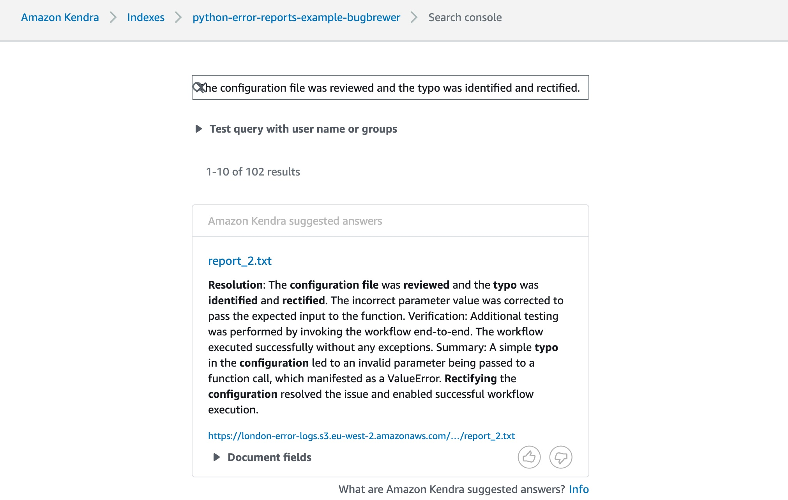
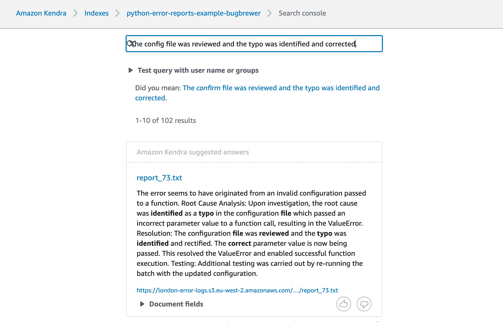

# Bug Brewer

This repository revolves around generating artificial python log data, where each log file ends with a randomly generated error. While `src/brewer` contains all code regarding the generation random log files, `src/documentarian` creates fictitious error reports from these log files, leveraging [Claude 2.1](https://www.anthropic.com/news/claude-2-1) on [AWS Bedrock](https://aws.amazon.com/bedrock/).

Here's an example of such a fictitous error report. Note that the code automatically appends the logs which `src/brewer` generated at the end of it.

```Example output


 Here is a draft error resolution report based on the details provided:

Error Resolution Report 

Error Encountered: 
ValueError with message "ERROR2034 - wrong value in function call"

Root Cause Analysis:
Upon investigation, the error was being caused by a typo in the configuration which was passing an incorrect parameter value to a function call. This invalid parameter value triggered the ValueError.

Resolution:  
The configuration file was reviewed and the typo was identified and rectified. The incorrect parameter value was corrected to pass the expected input to the function. 

Verification:
Additional testing was performed by invoking the workflow end-to-end. The workflow executed successfully without any exceptions. 

Summary:
A simple typo in the configuration led to an invalid parameter being passed to a function call, which manifested as a ValueError. Rectifying the configuration resolved the issue and enabled successful workflow execution.

Please let me know if you need any other details in the report. I can modify the summary and details as required.

Full error logs:

2024-05-26 13:07:46,555 - dynamic_logger.py - 37 - INFO - Added new handler: /opt/app-root/src/data/error_case_2.log
2024-05-26 13:07:46,557 - dynamic_logger.py - 47 - INFO - Logs have been rerouted.
2024-05-26 13:07:46,558 - main.py - 31 - INFO - Starting execution...
2024-05-26 13:07:46,560 - barista.py - 41 - INFO - n_calls: 300, proc_rate: 0.03
2024-05-26 13:07:46,561 - main.py - 34 - INFO - I am <class 'brewer.chaos_coffees.EspressoError'>
2024-05-26 13:07:46,562 - bean_bag.py - 22 - INFO - Starting execution of 300 number of nodes
2024-05-26 13:07:46,564 - bean_bag.py - 27 - INFO - Picked type<bound method BasicBean.node_3 of <brewer.chaos_coffees.EspressoError object at 0x7f5025f73230>>
2024-05-26 13:07:46,565 - bean_bag.py - 42 - INFO - Invoking node 1...
2024-05-26 13:07:46,566 - bean_bag.py - 43 - INFO - Node 3 ran as planned. No anomalies detected.
2024-05-26 13:07:46,567 - bean_bag.py - 27 - INFO - Picked type<bound method BasicBean.node_4 of <brewer.chaos_coffees.EspressoError object at 0x7f5025f73230>>
... (removed some lines for sake of brevity)
2024-05-26 13:07:46,614 - bean_bag.py - 42 - INFO - Invoking node 1...
2024-05-26 13:07:46,615 - bean_bag.py - 43 - INFO - Node 3 ran as planned. No anomalies detected.
2024-05-26 13:07:46,615 - bean_bag.py - 27 - INFO - Picked type<bound method BasicBean.node_1 of <brewer.chaos_coffees.EspressoError object at 0x7f5025f73230>>
2024-05-26 13:07:46,616 - bean_bag.py - 34 - INFO - Invoking node 1...
2024-05-26 13:07:46,617 - bean_bag.py - 35 - INFO - Node 1 completed as expected. Nothing weird going on here.
2024-05-26 13:07:46,618 - bean_bag.py - 27 - INFO - Picked type<bound method EspressoError.error_node of <brewer.chaos_coffees.EspressoError object at 0x7f5025f73230>>
2024-05-26 13:07:46,619 - chaos_coffees.py - 25 - INFO - Invoking node 15...
2024-05-26 13:07:46,620 - dynamic_logger.py - 51 - ERROR - An exception occurred: OSError: ERROR2033 - invalid configuration

The above exception was the direct cause of the following exception:

Traceback (most recent call last):
  File "/opt/app-root/src/brewer/chaos_coffees.py", line 27, in error_node
    raise self.error_types[0].error
  File "/opt/app-root/src/brewer/chaos_coffees.py", line 27, in error_node
    raise self.error_types[0].error
  File "/opt/app-root/src/brewer/chaos_coffees.py", line 46, in error_node
    raise self.error_types[0].error from self.error_types[1].error
ValueError: ERROR2034 - wrong value in function call

2024-05-26 13:07:46,622 - bean_bag.py - 30 - INFO - Stopping execution…
```

## Usage

What can you do with artificial log data and artificial error reports? Well, if you're interested in running analytics on such documents, it might be intersting to understand how certain technical approaches fare in extracting the correct insights from these type of documents. Sometimes you cannot use your real error logs due to confidentiality and/or the pattern you'd like to analyse does not occur sufficiently often.

Below you can find two screenshots where I ingested 100 such documents on [`AWS Kendra`](https://aws.amazon.com/pm/kendra/), using the following search queries:
1. The configuration file was reviewed and the typo was identified and rectified.
2. The config file was reviewed and the typo was identified and corrected.





### .env file
To run the code, you need to add the following `.env` file to the root directory of the repo.
```
aws_access_key="YOUR BEDROCK ACCESS KEY"
aws_secret_access_key="YOUR BEDROCK SECRET ACCESS KEY"
aws_region="YOUR REGION"
```

